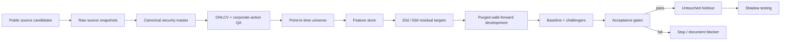

# EGX Quant Research

[](https://github.com/mrwanahmedx/EGX-Quant-Research/actions/workflows/ci.yml)

Research-first quantitative modeling and validation for the Egyptian Exchange (EGX).

This repository is intentionally built like a **model-research and validation project**, not a stock-picking demo. The objective is to create a reproducible pipeline that can ingest public EGX market data, enforce point-in-time controls, generate cross-sectional features and targets, evaluate baseline/challenger models, and refuse deployment when the evidence is not good enough.

> **Current status:** data QA is blocking real-model validation. The project does **not** claim historical validation, live alpha, or production readiness.

## Reviewer path

If you are reviewing this repository for quantitative-research or model-validation work, the fastest path is:

1. read [Current Status](docs/CURRENT_STATUS.md) for the present evidence gate,
2. inspect the architecture and validation philosophy below,
3. review [Scanner Lineage](docs/SCANNER_LINEAGE.md) for failed / superseded approaches,
4. review the tests for leakage, split, grain, cost, and reproducibility controls,
5. treat every blocked gate as an explicit research result — not as missing polish.

**What this repository demonstrates:** research design, evidence gating, validation discipline, reproducibility controls, and willingness to stop when data quality invalidates modeling.

**What it does not demonstrate yet:** validated EGX alpha, investable historical performance, or a production trading system.

## Legacy scanner archive

The pre-research scanner generations are preserved in [`archive/legacy-scanners/`](archive/legacy-scanners/README.md). V1.1 and V1.2 include recovered, sanitized source and rerun tests; user-specific portfolio/database artifacts are omitted with hashes recorded. V1, V1.2-fixed and V2–V2.4 are history-only where source artifacts could not be recovered. Missing code is not reconstructed.

Every archived generation is **discontinued and not production/deployment eligible**. The archive exists to show the progression of controls, failed validation attempts and research lessons—not to imply historical profitability.

## Research design

- broader EGX universe, not a hand-picked watchlist,
- 20-trading-day and 63-trading-day residual-return targets,
- Qlib / Alpha158-style features plus EGX-relative signals,
- Linear and Lasso baselines,
- LightGBM, XGBoost ranker and CatBoost challengers,
- sector / beta neutralisation,
- Top-K / dropout portfolio research,
- purged walk-forward development,
- development freeze at **2026-01-31**,
- untouched **2026-02-01 to 2026-06-30** holdout,
- September 2026 shadow period,
- realistic execution costs and next-session execution,
- benchmark comparison only when benchmark data is evidenced.

## Current evidence state

The latest real-data work has already shown why the gates matter:

- 966,215 pre-holdout OHLCV rows ingested across two public Kaggle datasets plus a Yahoo extension,
- 289 identifiers reconciled against EGX security metadata,
- 140,518 impossible OHLC rows detected,
- real modeling therefore remains blocked until the canonical data layer passes QA.

Earlier synthetic protocol runs were useful for testing machinery, but they are not evidence of real EGX alpha. The holdout stays unopened until point-in-time universe, corporate-action, price-quality and provenance controls pass. The repository now contains fail-closed evidence, quarantine and security-master machinery so a row cannot enter real model development without those controls.

See [Current Status](docs/CURRENT_STATUS.md), [Scanner Lineage](docs/SCANNER_LINEAGE.md), the [Foundation-Model Challenger Policy](docs/FOUNDATION_MODEL_POLICY.md), the [Evidence Layer](evidence/README.md), and the [Public Source Inventory](docs/SOURCE_INVENTORY.md).

## Architecture



## Repository structure

```text
config/                 immutable research configuration
data/                   documentation only; raw market files are not committed
docs/                   protocol, contracts, gates, status and roadmap
archive/                recovered legacy scanner lineage and history-only records
schemas/                experiment / model-registry schemas
src/egx_quant/          reusable research controls
tests/                  leakage, grain, split, cost and reproducibility tests
.github/                CI and research issue templates
```

## Validation philosophy

A model is not promoted because a backtest looks attractive. Before the holdout can be touched, the project requires evidence for point-in-time membership, price integrity, corporate actions, provenance, duplicate control, leakage-safe timing, frozen development boundaries, costs, reproducibility and valid benchmarks.

Planned statistical evaluation includes Rank IC stability, turnover, net-of-cost results, PSR/DSR, PBO/CSCV and Reality Check-style controls where the sample supports them.

## Quick start

Python 3.11+.

```bash
python -m pip install -e .
python -m unittest discover -s tests -v
python -m compileall src tests
```

The initial package has no third-party runtime dependency. Modeling libraries are added after the real-data contract is ready.

## Public-data route

Candidate sources being reconciled include public EGX Kaggle histories, Yahoo extensions where available, Hugging Face EGX security metadata, and official public disclosures for corporate-action / reference checks.

These are **inputs to QA**, not automatically trusted truth.

## Research integrity

- No employer data or internal bank information.
- No fabricated market data or performance.
- Missing evidence produces a blocker, not a synthetic substitute.
- Current classifications are never projected backward without effective-date evidence.
- Source conflicts are logged and resolved before modeling.
- This repository is research, not investment advice.

Code is MIT licensed. Third-party data retains its own terms and is not redistributed here.
